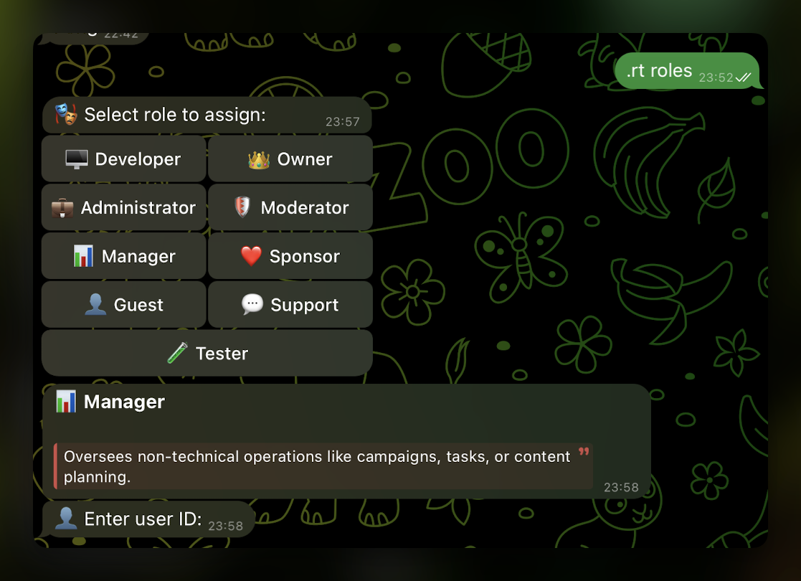

<div align="center">
    <h1 id="header" align="center">🔦 Raito</h1>
    <p align="center">The missing toolkit for aiogram. Hot-reload, roles, pagination, scenes and dev tools, all included.</p>
</div>

<div align="center">


</div>

<div align="center">


</div>

---

## Highlights

- 🔥 **Hot Reload** — automatic router loading and file watching for instant development cycles
- 🎭 **Role System** — pre-configured roles (owner, support, tester, etc) and selector UI
- 📚 **Pagination** — easy pagination over text and media using inline buttons
- 🎬 **Scenes** — multi-step dialogs that release request-scoped dependencies after each message
- 🚀 **CLI Generator** — `$ raito init` creates a ready-to-use bot template in seconds
- ⌨️ **Keyboard Factory** — static and dynamic generation
- 🛠️ **Command Registration** — automatic setup of bot commands with descriptions for each
- 🖼️ **Album Support** — groups media albums and passes them to handlers
- 🛡️ **Rate Limiting** — apply global or per-command throttling via decorators or middleware
- 💾 **Database Storages** — optional JSON & SQL support
- 🧪 **REPL** — execute async Python in context (`_msg`, `_user`, `_raito`)
- 🔍 **Params Parser** — extracts and validates command arguments
- ✏️ **Logging Formatter** — beautiful, readable logs out of the box
- 📊 **Metrics** — inspect memory usage, uptime, and caching stats


## Installation

```bash
pip install -U raito
```


## Quick Start

```python
import asyncio

from aiogram import Bot, Dispatcher
from raito import Raito


async def main() -> None:
    bot = Bot(token="TOKEN")
    dispatcher = Dispatcher()
    raito = Raito(dispatcher, "src/handlers")

    await raito.setup()
    await dispatcher.start_polling(bot)


if __name__ == "__main__":
    asyncio.run(main())
```

## Why Raito?

Raito speeds up your bot development by removing the boring parts — no more boilerplate, no more manual restarts, no more duplicated code across projects. \
Everything that used to slow you down is already solved.


## Showcases

#### 📦 Handling Commands

You can control access to commands using `@rt.roles`

The `@rt.description` decorator adds a description to each command — they will show up in the slash menu automatically.

For commands like `/ban 1234`, use `@rt.params` to extract and validate the arguments.

Limit command usage with `@rt.limiter` and control the rate by mode.

```python
from aiogram import Bot, Router, filters, types

from raito import rt
from raito.plugins.roles import ADMINISTRATOR, MODERATOR, OWNER

router = Router(name="ban")


@router.message(filters.Command("ban"), OWNER | ADMINISTRATOR | MODERATOR)
@rt.description("Ban a user")
@rt.limiter(300, mode="chat")
@rt.params(user_id=int)
async def ban(message: types.Message, user_id: int, bot: Bot):
    await bot.ban_chat_member(chat_id=message.chat.id, user_id=user_id)
    await message.answer(text="✅ User banned successfully!")
```

---

#### 🔥 Hot-Reload & Router Management

Whenever you change a file with handlers, Raito automatically reloads it without restarting the bot.

You can also manage your routers manually using the `.rt load`, `.rt unload`, `.rt reload`, or `.rt routers` commands in the bot.

https://github.com/user-attachments/assets/c7ecfb7e-b709-4f92-9de3-efc4982cc926

---

#### 🎭 Roles

Use built-in roles to set different access levels for team members.

<p align="left">
  
</p>

---

#### 📚 Pagination

The simplest, most native and most effective pagination. Unlike many other libraries, it **does not use internal storage**. \
It is very user-friendly and fully customizable.

```python
from aiogram import Bot, filters, types

from raito import Raito, Router, rt
from raito.plugins.pagination import InlinePaginator

router = Router(name="pagination")


@router.message(filters.Command("pagination"))
async def pagination(message: types.Message, raito: Raito, bot: Bot):
    if not message.from_user:
        return

    await raito.paginate(
        "button_list",
        chat_id=message.chat.id,
        bot=bot,
        from_user=message.from_user,
        limit=5,
    )


# mock data
BUTTONS = [
    types.InlineKeyboardButton(text=f"Button #{i}", callback_data=f"button:{i}")
    for i in range(10000)
]


@router.on_pagination("button_list")
async def on_pagination(
    query: types.CallbackQuery,
    paginator: InlinePaginator,
    offset: int,
    limit: int,
):
    content = BUTTONS[offset : offset + limit]
    await paginator.answer(text="Here is your buttons:", buttons=content)
```

---

#### 🎬 Scenes

Multi-step dialogs where every step is an ordinary handler. Request-scoped dependencies — like an SQLAlchemy `AsyncSession` — are released between messages instead of held while the user thinks. \
Steps are native aiogram states carrying a typed draft in FSM storage. Register them under the router's own event names, drive the flow with `scene.next()` / `scene.finish()`, and get inline buttons (`@mute.on_callback_query`) for free.

```python
from aiogram import F, filters, types
from aiogram.fsm.state import State, StatesGroup
from sqlalchemy.ext.asyncio import AsyncSession

from raito import Router
from raito.plugins.scenes import Scene, SceneData

router = Router(name="scene", priority=100)


class MuteData(SceneData):
    username: str | None = None


class MuteStates(StatesGroup):
    username = State()
    duration = State()


mute = router.scene(MuteStates, data=MuteData)


@mute.on_message.enter(filters.Command("mute"))
async def start(message: types.Message, scene: Scene[MuteData]):
    await message.answer("Enter username:")
    await scene.next()


@mute.on_message(MuteStates.username, F.text)
async def username(message: types.Message, scene: Scene[MuteData]):
    scene.data.username = message.text
    await message.answer("Enter duration in minutes:")
    await scene.next()


@mute.on_message(MuteStates.duration, F.text)
async def duration(message: types.Message, scene: Scene[MuteData], session: AsyncSession):
    await mute_user(session, scene.data.username, int(message.text or 0))
    await message.answer("✅ User muted")
    await scene.finish()
```

---

#### ⌨️ Keyboards

Sometimes you want quick layouts. Sometimes — full control. You get both.

##### Static (layout-based)
```python
from aiogram import Router, filters, types

from raito import rt

router = Router(name="info")


@rt.keyboard.static(inline=True)
def information_markup():
    return [
        ("📄 Terms of Service", "tos"),
        [("ℹ️ About", "about"), ("⚙️ Website", "web")],
    ]


@router.message(filters.Command("info"))
async def info(message: types.Message):
    await message.answer(text="Information:", reply_markup=information_markup())
```

##### Dynamic (builder-based)
```python
from aiogram import Router, filters, types
from aiogram.utils.keyboard import ReplyKeyboardBuilder

from raito import rt

router = Router(name="start")


@rt.keyboard.dynamic(1, 2, adjust=True, inline=False)
def start_menu_markup(builder: ReplyKeyboardBuilder, app_url: str):
    builder.button(text="📱 Open App", web_app=types.WebAppInfo(url=app_url))
    builder.button(text="💬 Support")
    builder.button(text="📢 Channel")


@router.message(filters.CommandStart())
async def start(message: types.Message):
    await message.answer(
        text="Welcome!",
        reply_markup=start_menu_markup(app_url="https://example.com"),
    )
```

---

#### 🍃 Lifespan

Define startup and shutdown logic in one place.

```python
from aiogram import Bot

from raito import Router, rt

router = Router(name="lifespan")


@router.lifespan()
async def lifespan(bot: Bot):
    user = await bot.get_me()
    rt.debug("🚀 Bot [%s] is starting...", user.full_name)

    yield

    rt.debug("👋🏻 Bye!")
```

## Contributing

Have an idea, found a bug, or want to improve something? \
Contributions are welcome! Feel free to open an issue or submit a pull request.


## Security

If you discover a security vulnerability, please report it responsibly. \
You can open a private GitHub issue or contact the maintainer directly.

There’s no bounty program — this is a solo open source project. \
Use in production at your own risk.

> For full details, check out the [Security Policy](SECURITY.md).


## Questions?

Open an issue or start a discussion in the GitHub Discussions tab. \
You can also ping [@Aidenable](https://github.com/Aidenable) for feedback or ideas.


[](#header)
